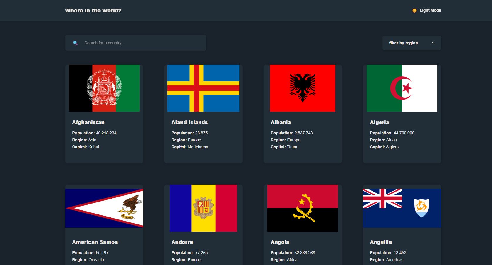
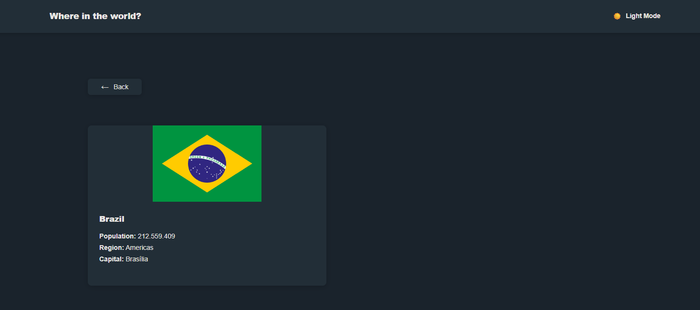

# 🌎 Country Explorer

Aplicação web desenvolvida em React que permite visualizar, buscar e filtrar países, exibindo informações detalhadas como população, região e capital.

---

## 🚀 Funcionalidades

* 🔍 Busca de países por nome
* 🌍 Filtro por região
* 📄 Página de detalhes do país
* 🏳️ Exibição de bandeiras
* 🔙 Navegação entre lista e detalhes

---

## 🛠️ Tecnologias utilizadas

* React.js
* JavaScript (ES6+)
* HTML5
* CSS3

---

## 📸 Preview






---

## 🌐 Deploy

👉 https://wiarley-sena.github.io/API-REST-para-pa-ses/

---

## ⚙️ Como rodar o projeto

```bash
# Clone o repositório
git clone https://github.com/wiarley-sena/API-REST-para-pa-ses.git

# Acesse a pasta
cd API-REST-para-pa-ses

# Instale as dependências
npm install

# Rode o projeto
npm start
```

---

## 📌 Aprendizados

Durante o desenvolvimento deste projeto, aprendi:

* Manipulação de estado com React (`useState`)
* Renderização condicional
* Componentização
* Organização de projetos em React
* Manipulação e exibição de dados JSON

---

## 💡 Melhorias futuras

* 🌙 Dark mode
* 🌐 Tradução (PT/EN)
* 🔗 Integração com API real (REST Countries)
* 📱 Melhor responsividade

---

## 👨‍💻 Autor

Feito por **Wiarley Sena** 🚀
